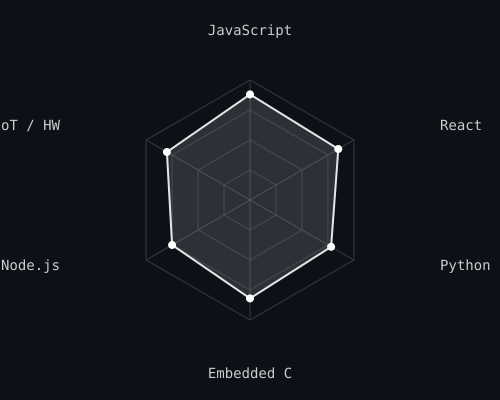

 

# Nithin Goud

Electronics & Communication Engineering, on paper. Shipped mostly software.

 

### SchedTiny

An embedded scheduling system — hardware and software agreeing on what "on time" actually means. Open source, with a research journal published alongside the code, so the reasoning is there, not just the result.

`[live demo]` · `[source]` · `[research journal]`

Background in RTOS internals or timing-critical systems? I'd genuinely like to know what I got wrong.

 
 

 
 

### Stack

 
 

### Shipped

Four products, four unrelated problems — the goal was learning to finish, not finding a niche.

`watchNXT` — watchlist tracker
→ [live](https://watchnxt.careerupdates.co.in/) · [code](https://github.com/nithingoud78/watchNXT)

`Abroad Compass` — study-abroad planning
→ [live](https://abroadcompass.careerupdates.co.in/) · [code](https://github.com/nithingoud78/abroad-compass)

`CareerUpdates` — job & career board
→ [live](https://careerupdates.co.in/) · [code](https://github.com/nithingoud78/CareerUpdates)

`FallAlert` — fall detection for elder safety
→ [live](https://fall-alert.vercel.app/) · [code](https://github.com/nithingoud78/FallAlert)

 

[LinkedIn](https://linkedin.com/in/nithin-goud78) · [k.nithingoud78@gmail.com](mailto:k.nithingoud78@gmail.com)

A ⭐ on any repo tells me which one to keep pushing on.
